<!-- AOC TILES BEGIN -->
<h1 align="center">
  2022 - 2 ⭐
</h1>
<a href="https://github.com/reckter/aoc2022/blob/main/main/days/Day1.kt">
  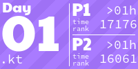
</a>
<a href="https://github.com/reckter/aoc2022/blob/main/main/days/Day2.kt">
  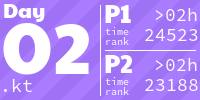
</a>
<a href="https://github.com/reckter/aoc2022/blob/main/main/days/Day3.kt">
  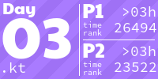
</a>
<a href="https://github.com/reckter/aoc2022/blob/main/main/days/Day4.kt">
  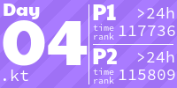
</a>

<a href="https://github.com/reckter/aoc2022/blob/main/main/days/Day7.kt">
  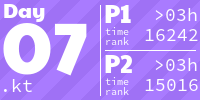
</a>

<h1 align="center">
  2021 - 50 ⭐
</h1>
<a href="https://github.com/reckter/aoc2021/blob/main/main/days/Day1.kt">
  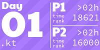
</a>
<a href="https://github.com/reckter/aoc2021/blob/main/main/days/Day2.kt">
  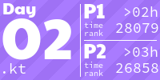
</a>

<a href="https://github.com/reckter/aoc2021/blob/main/main/days/Day6.kt">
  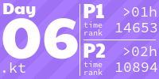
</a>
<a href="https://github.com/reckter/aoc2021/blob/main/main/days/Day7.kt">
  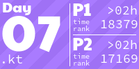
</a>

<a href="https://github.com/reckter/aoc2021/blob/main/main/days/Day10.kt">
  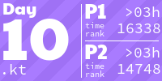
</a>
<a href="https://github.com/reckter/aoc2021/blob/main/main/days/Day11.kt">
  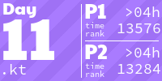
</a>

<a href="https://github.com/reckter/aoc2021/blob/main/main/days/Day13.kt">
  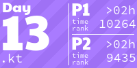
</a>
<a href="https://github.com/reckter/aoc2021/blob/main/main/days/Day14.kt">
  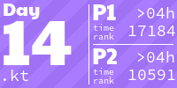
</a>
<a href="https://github.com/reckter/aoc2021/blob/main/main/days/Day15.kt">
  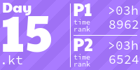
</a>
<a href="https://github.com/reckter/aoc2021/blob/main/main/days/Day16.kt">
  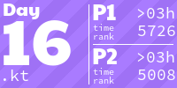
</a>
<a href="https://github.com/reckter/aoc2021/blob/main/main/days/Day17.kt">
  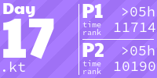
</a>
<a href="https://github.com/reckter/aoc2021/blob/main/main/days/Day18.kt">
  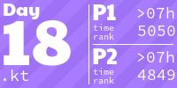
</a>
<a href="https://github.com/reckter/aoc2021/blob/main/main/days/Day19.kt">
  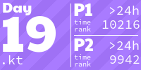
</a>

<a href="https://github.com/reckter/aoc2021/blob/main/main/days/Day22.kt">
  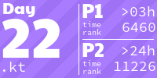
</a>

<a href="https://github.com/reckter/aoc2021/blob/main/main/days/Day24.kt">
  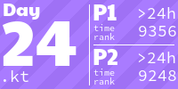
</a>

<h1 align="center">
  2020 - 50 ⭐
</h1>

<a href="https://github.com/reckter/aoc2020/blob/main/main/days/Day2.kt">
  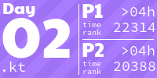
</a>

<a href="https://github.com/reckter/aoc2020/blob/main/main/days/Day5.kt">
  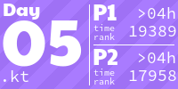
</a>
<a href="https://github.com/reckter/aoc2020/blob/main/main/days/Day6.kt">
  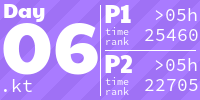
</a>
<a href="https://github.com/reckter/aoc2020/blob/main/main/days/Day7.kt">
  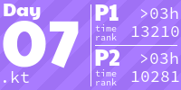
</a>

<a href="https://github.com/reckter/aoc2020/blob/main/main/days/Day10.kt">
  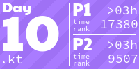
</a>
<a href="https://github.com/reckter/aoc2020/blob/main/main/days/Day11.kt">
  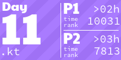
</a>
<a href="https://github.com/reckter/aoc2020/blob/main/main/days/Day12.kt">
  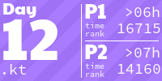
</a>
<a href="https://github.com/reckter/aoc2020/blob/main/main/days/Day13.kt">
  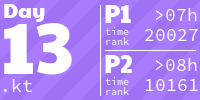
</a>
<a href="https://github.com/reckter/aoc2020/blob/main/main/days/Day14.kt">
  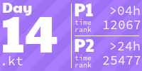
</a>
<a href="https://github.com/reckter/aoc2020/blob/main/main/days/Day15.kt">
  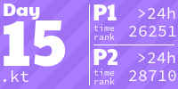
</a>
<a href="https://github.com/reckter/aoc2020/blob/main/main/days/Day16.kt">
  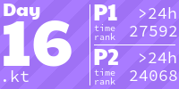
</a>
<a href="https://github.com/reckter/aoc2020/blob/main/main/days/Day17.kt">
  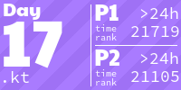
</a>
<a href="https://github.com/reckter/aoc2020/blob/main/main/days/Day18.kt">
  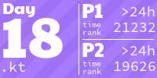
</a>

<a href="https://github.com/reckter/aoc2020/blob/main/main/days/Day20.kt">
  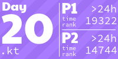
</a>

<a href="https://github.com/reckter/aoc2020/blob/main/main/days/Day22.kt">
  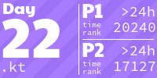
</a>
<a href="https://github.com/reckter/aoc2020/blob/main/main/days/Day23.kt">
  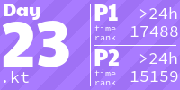
</a>
<a href="https://github.com/reckter/aoc2020/blob/main/main/days/Day24.kt">
  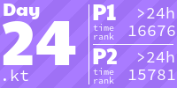
</a>
<a href="https://github.com/reckter/aoc2020/blob/main/main/days/Day25.kt">
  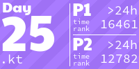
</a>
<h1 align="center">
  2019 - 50 ⭐
</h1>
<a href="https://github.com/reckter/aoc2019/blob/main/main/days/Day1.kt">
  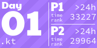
</a>

<a href="https://github.com/reckter/aoc2019/blob/main/main/days/Day5.kt">
  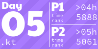
</a>

<a href="https://github.com/reckter/aoc2019/blob/main/main/days/Day7.kt">
  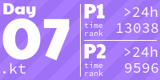
</a>
<a href="https://github.com/reckter/aoc2019/blob/main/main/days/Day8.kt">
  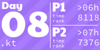
</a>
<a href="https://github.com/reckter/aoc2019/blob/main/main/days/Day9.kt">
  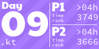
</a>
<a href="https://github.com/reckter/aoc2019/blob/main/main/days/Day10.kt">
  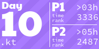
</a>
<a href="https://github.com/reckter/aoc2019/blob/main/main/days/Day11.kt">
  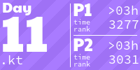
</a>
<a href="https://github.com/reckter/aoc2019/blob/main/main/days/Day12.kt">
  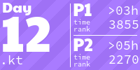
</a>
<a href="https://github.com/reckter/aoc2019/blob/main/main/days/Day13.kt">
  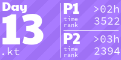
</a>
<a href="https://github.com/reckter/aoc2019/blob/main/main/days/Day14.kt">
  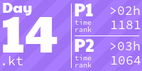
</a>
<a href="https://github.com/reckter/aoc2019/blob/main/main/days/Day15.kt">
  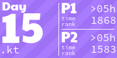
</a>

<a href="https://github.com/reckter/aoc2019/blob/main/main/days/Day19.kt">
  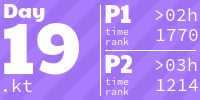
</a>

<h1 align="center">
  2018 - 50 ⭐
</h1>

<h1 align="center">
  2016 - 50 ⭐
</h1>

<!-- AOC TILES END -->