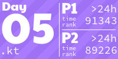
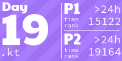
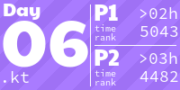
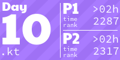

<!-- AOC TILES BEGIN -->
<h1 align="center">
  2022 - 2 ⭐
</h1>

<h1 align="center">
  2021 - 50 ⭐
</h1>

<h1 align="center">
  2020 - 50 ⭐
</h1>

<h1 align="center">
  2019 - 50 ⭐
</h1>

<h1 align="center">
  2018 - 50 ⭐
</h1>

<h1 align="center">
  2016 - 50 ⭐
</h1>

<!-- AOC TILES END -->